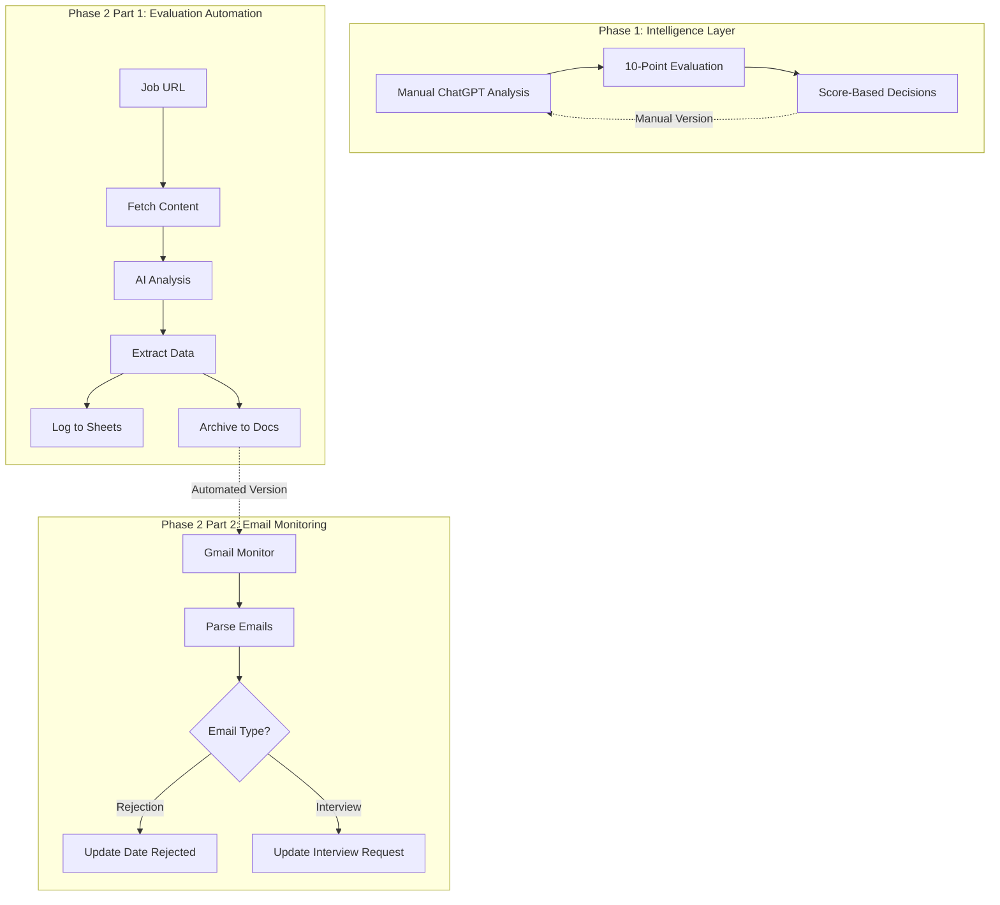
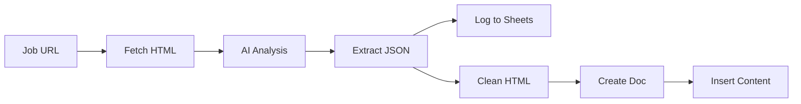
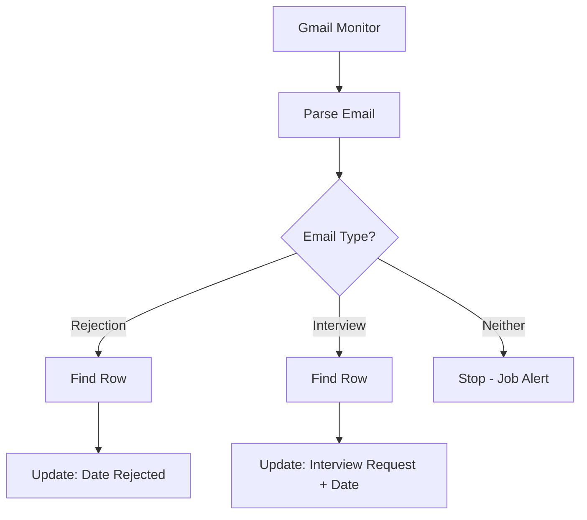

# AI-Powered Job Search Intelligence System

> **A complete automation pipeline transforming job search from reactive chaos to data-driven strategy**

[]() []() []() []()

---

## Why This Exists

Job search data reveals a brutal reality: 79% of candidates experience anxiety and burnout, spending 11-25 hours weekly on applications with online success rates of just 0.1-2%. Most rely on a single resume they tweak per role—an approach that fails in competitive markets but feels necessary when each application takes 30-45 minutes.

Through working with job seekers and analyzing application patterns, several systemic problems became clear:

### **The Resume Problem**
Most job seekers use 1-2 generic resumes to apply for dozens of different roles. These resumes don't stand out for any specific position because they're not targeted. Customizing for each application takes too long, so people default to spray-and-pray approaches that compound the problem.

### **The Alignment Gap**
In competitive markets with more candidates than jobs, generic applications don't cut it. But most people don't have a systematic way to evaluate whether their background truly aligns with a role before investing hours in an application. The result: wasted time on poor-fit positions and missed opportunities on good matches.

### **The Tracking Void**
Without structured tracking, you can't learn from patterns:
- Which resume types generate callbacks?
- What job characteristics correlate with interviews?
- Are certain ATS systems or companies consistently rejecting you?
- When do rejections typically arrive?
- Which strategies actually work vs. feel productive?

Without data, you're repeating the same ineffective approaches indefinitely.

### **The Human Cost**
Job searching is mentally, emotionally, and physically exhausting. The more tedious and uncertain the process, the worse the burnout. The combination of high time investment, low success rates, and lack of feedback creates a grinding cycle that erodes confidence and motivation.

### **The Solution: Systematic Redesign**

**The process needs systematic redesign, not harder work.**

This system addresses all of these issues:
- ✅ **Multiple targeted resumes** with systematic matching logic (13 specialized profiles)
- ✅ **Evaluation before effort** - know if it's worth applying before investing time
- ✅ **Automatic tracking** - learn from patterns without manual data entry
- ✅ **Reduced decision fatigue** - structured framework eliminates guesswork
- ✅ **Measurable outcomes** - 70-85% time reduction per application while improving quality
- ✅ **Pattern recognition** - identify what works and adapt strategy accordingly

**Real impact:** This system makes the job search process more manageable by reducing time waste, providing clear decision frameworks, and enabling pattern recognition. It won't guarantee outcomes—no system can in a competitive market—but it makes a brutal process less chaotic and more data-informed.

---

## Table of Contents

- [System Overview](#system-overview)
- [What It Does](#what-it-does)
- [Phase 1: Prompt Engineering Framework](#phase-1-prompt-engineering-framework)
- [Phase 2: Complete Automation](#phase-2-complete-automation)
- [Example Output](#example-output)
- [Skills Demonstrated](#skills-demonstrated)
- [Limitations & Workarounds](#limitations--workarounds)
- [Setup Guide](#setup-guide)
- [Data & Insights](#data--insights)
- [For Different Audiences](#for-different-audiences)

---

## System Overview

This is a **two-phase job search intelligence system** that combines advanced prompt engineering with workflow automation to create an end-to-end solution for job searching, evaluation, tracking, and interview preparation.

### Architecture



---

## What It Does

### **Intelligent Job Evaluation**
- Analyzes job postings against 13 specialized resume profiles
- Evaluates fit across 10 criteria with transparent scoring
- Identifies gaps, risks, and mitigation strategies
- Recommends specific resumes and capabilities statements
- Provides salary intelligence and strategic positioning

### **Automated Tracking**
- Auto-logs applications to Google Sheets with scores and metadata
- Archives full job descriptions to Google Docs (cleaned HTML)
- Monitors email for rejections and interview requests
- Updates spreadsheet automatically based on email content
- Tracks ATS systems, rejection timing, and interview conversion

### **Data-Driven Insights**
- Score correlation with interview callbacks
- Rejection patterns by ATS system and timing
- Resume type effectiveness analysis
- Salary range vs. actual offer tracking
- Time-to-interview by company/role type

---

## Phase 1: Prompt Engineering Framework

**Status:** ✅ Complete | **Format:** ChatGPT conversation thread | **Cost:** Free (with ChatGPT Plus)

### The Foundation

A battle-tested prompt system that evaluates job postings using a structured 10-criteria framework.

### How It Works

**Setup:**
1. ChatGPT stores 13 specialized resume profiles in memory
2. Evaluation prompt defines scoring framework and decision logic
3. Separate thread for application question assistance (prevents context pollution)

**Evaluation Criteria:**
1. **Resume Match** - Which of 13 profiles fits best and why
2. **Alignment Strengths** - How candidate experience maps to requirements
3. **Risk Factors** - Gaps, concerns, and mitigation strategies (with impact ratings)
4. **Tri-Score System** - Resume Fit, ATS Fit, Overall Fit (1-10 scale each)
5. **Application Recommendation** - Go/no-go with reasoning
6. **Resume Strategy** - Is a new resume category needed?
7. **Location Verification** - Remote/acceptable locations confirmed
8. **Salary Intelligence** - Range analysis and offer prediction
9. **Capabilities Statement** - Which portfolio piece to attach
10. **Strategic Positioning** - Career trajectory and role classification

### Decision Logic

| Overall Fit | Action | Data Insight |
|-------------|--------|--------------|
| 9.5+ | Definite Apply | Highest quality but surprisingly lower callbacks (market saturation) |
| 8.8-9.4 | Strong Apply | **Optimal range** - highest interview conversion |
| 8.0-8.7 | Apply with Awareness | Moderate success; gap mitigation critical |
| 7.0-7.9 | Marginal | Only if strategic justification exists |
| <7.0 | Skip | Time better spent elsewhere |

### Key Innovations

**Multi-threaded Architecture:**
- **Evaluation thread:** Job analysis only
- **Application questions thread:** Response drafting and scoring
- **Why:** Prevents context pollution and maintains consistent output quality

**Data-Driven Thresholds:**
- Initial hypothesis: 9.5+ = best outcomes
- Reality after 500+ applications: **8.8-9.4 range has highest callback rate**
- System adapted based on actual performance data

**LLM Limitation Workarounds:**
- Explicit "read entire description, don't skim" instruction
- Force analysis of actual resume content vs. assumed content
- Secondary resume recommendation for verification (later removed to prevent user confusion)

### Performance Metrics

- **Applications Analyzed:** 500+
- **Time Savings:** 70-85% per application
- **Score Accuracy:** 8.8+ correlates with interview requests
- **Pattern Discovery:** Implementation roles consistently auto-reject due to "external client experience" gap

---

## Phase 2: Complete Automation

**Status:** ✅ Complete | **Platform:** N8N | **Cost:** ~$25/month N8N + ~$2/month OpenAI API

### Part 1: Job Evaluation & Logging Automation

**Workflow:** 8 nodes, fully automated from URL to archive

#### Node-by-Node Breakdown

**1. Form Trigger (n8n Form)**
- User submits job posting URL via web form
- Accessible from any device via bookmark
- Single required field: `Job_Link`

**2. HTTP Request**
- Fetches job posting content from submitted URL
- Retrieves complete HTML including job description, requirements, company info
- Output: `data` field containing raw HTML

**3. AI Analysis (OpenAI - Message a Model)**
- **Model:** GPT-4o-mini (optimal cost/performance)
- **System Prompt:** Complete evaluation framework including:
  - Candidate background summary
  - 13 resume profile descriptions
  - 10-point evaluation criteria
  - JSON output requirements for data logging
- **User Prompt:** Raw job posting HTML from HTTP Request
- **Output:** Full narrative analysis + structured JSON block labeled "DATA FOR LOGGING"

**4. JSON Extraction (Code - JavaScript)**
- Parses OpenAI response text
- Extracts JSON block from "DATA FOR LOGGING" section using regex
- Converts to structured JavaScript object
- **Output fields:** `company_name`, `job_title`, `location`, `resume_match`, `resume_fit_score`, `ats_fit_score`, `overall_fit_score`, `apply_recommendation`, `salary_range`, `capabilities_statement`, `risk_level`, `date_analyzed`

**5. Google Sheets Logging (Append Row)**
- Connects to "Job Application Tracking" spreadsheet
- Maps JSON fields to spreadsheet columns
- Appends new row with all evaluation data
- Checkbox field for "Apply?" based on recommendation

**6. HTML Cleaning (Code - JavaScript)**
- Strips `<script>` and `<style>` tags
- Removes all HTML markup
- Decodes HTML entities (`&nbsp;`, `&amp;`, etc.)
- Adds line breaks after block elements (`<p>`, `<div>`, `<h1>`, etc.)
- Normalizes excessive whitespace
- **Output:** `cleanJobDescription` - human-readable text suitable for Google Docs

**7. Google Docs Creation (Create Document)**
- Creates empty document in "Job Search Intelligence" folder
- **Title format:** `[Company Name] - [Job Title]`
- Returns document ID for next step

**8. Google Docs Update (Update Document)**
- Takes document ID from previous node
- Inserts cleaned job description into document body
- Archives complete job posting for interview preparation

#### Data Flow Diagram



### Part 2: Email Monitoring Automation

**Workflow:** 5 nodes with conditional branching, runs every 6 hours

#### Node-by-Node Breakdown

**1. Gmail Trigger (On Message Received)**
- **Polling Frequency:** Every 6 hours (4x daily)
- **Filters:**
  - Subject contains: application, interview, position, opportunity, candidate, schedule, "next steps"
  - From ATS systems: Greenhouse, Lever, Workable, Workday, Ashby, Rippling, SmartRecruiters, iCIMS
  - Excludes: LinkedIn alerts, Indeed alerts, Glassdoor, ZipRecruiter
- **Includes:** Spam/trash (catches legitimate emails mislabeled)

**2. Email Parser (Code - JavaScript)**
Extracts and structures email data:
- **Email date:** Converts to MM-DD-YYYY format
- **ATS system:** Identifies from sender domain and email body (falls back to "Unknown")
- **Email type detection:**
  - **Rejection keywords:** "unfortunately," "not moving forward," "decided to pursue," "position filled"
  - **Interview keywords:** "schedule," "interview," "available for," "next steps," "speak with"
- **Company name extraction:** Parses from subject/body
- **Job title extraction:** Parses from subject/body
- **Output:** Structured JSON with `atsSystem`, `companyName`, `jobTitle`, `isRejection`, `isInterview`, `emailDate`

**3. Switch Node (Conditional Routing)**
Two conditions evaluated:
- **Path 1:** `isRejection === true`
- **Path 2:** `isInterview === true`
- **No match:** Email stops here (expected for job alerts that passed initial filters)

**4. Rejection Path (2 nodes)**
- **Get Rows (Google Sheets):** Finds matching application
  - Filter: `Company Name = {{company}}` AND `Job Title = {{jobTitle}}`
  - Why two nodes: Google Sheets Update only allows single-column matching; Get Rows enables multi-column filter
- **Update Row (Google Sheets):** Sets `Date Rejected = {{emailDate}}`

**5. Interview Path (2 nodes)**
- **Get Rows (Google Sheets):** Same matching logic as rejection path
- **Update Row (Google Sheets):** Sets `Interview Request = TRUE` (checkbox) and `Interview Contact Date = {{emailDate}}`

#### Email Processing Diagram



### Integration Points

Both workflows write to the same Google Sheet:
- **Part 1** creates new rows (applications)
- **Part 2** updates existing rows (outcomes)
- Shared columns: Company Name, Job Title (used for matching)

---

## Example Output

### AI Analysis Sample

Based on actual evaluation of "Customer Operations Manager" role at Funnel Leasing:

**Resume Match:** Customer Support Lead, Support Enablement Master

**Scores:**
- Resume Fit: 9/10
- ATS Fit: 8/10
- Overall Fit: 8.5/10

**Recommendation:** ✅ Yes - Strong Apply

**Alignment Strengths:**
- 15+ years managing global support teams (direct match)
- ServiceNow expertise transferable to Zendesk requirement
- Process improvement background (Lean Six Sigma) aligns with continuous improvement culture
- Proven team mentorship experience

**Risk Factors:**
| Gap | Impact | Mitigation |
|-----|--------|------------|
| Healthcare domain (HIPAA) | Minor | Position SOX compliance as regulatory parallel |
| Zendesk vs. ServiceNow | Minimal | Emphasize platform-agnostic ticketing expertise |

**Salary Analysis:**
- Posted: $95K-$105K
- Predicted Offer: $105K-$110K (upper range justified by experience + certifications)

**Capabilities Statement:** Team Leadership, Support Operations

---

## Skills Demonstrated

### AI & Prompt Engineering
- Multi-criteria decision framework design
- Structured output formatting (JSON extraction from narrative)
- Context window management across 13 resume profiles
- Iterative prompt refinement based on real-world testing
- LLM limitation identification and workaround implementation

### Workflow Automation
- N8N multi-node orchestration
- Conditional logic and branching (Switch nodes)
- API integration (OpenAI, Google Workspace)
- OAuth 2.0 authentication setup
- Error handling and data validation
- Scheduled triggers and polling strategies

### Data Engineering
- HTML parsing and text extraction
- Regular expression implementation for text processing
- JSON manipulation and field mapping
- Multi-column lookup logic
- Data normalization and cleaning

### Process Improvement
- Waste elimination through automation (70-85% time reduction)
- Quality control via systematic evaluation
- Feedback loop implementation (score accuracy validation)
- Metrics-driven decision thresholds
- Documentation and knowledge capture

### Technical Implementation
- JavaScript implementation (code modification and integration)
- Gmail search syntax for filtering
- Google Sheets formula integration
- API rate limiting consideration
- Cross-platform data flow management

---

## Limitations & Workarounds

### Known Issues

**1. JavaScript-Heavy Job Sites**

**Issue:** Sites using JavaScript frameworks to load content dynamically return "You need JavaScript to run this app" message instead of job description.

**Affected Sites:** Ashby. Other modern ATS systems using JavaScript frameworks may have similar issues.

**Identification:** Ashby is easily identifiable by URL structure (`ashbyhq.com` in application link)

**Workaround:** 
Manually copy job description text and paste into a Google Doc in the "Job Search Intelligence" folder. Maintain consistent naming: [Company Name] - [Job Title]. This preserves the archive for interview prep while keeping organization consistent with automated documents.

**Why Not Fixed:** Rendering JavaScript requires headless browser (Puppeteer/Browserless), adding significant cost and complexity. Server-rendered sites (Greenhouse, direct company career pages, SmartRecruiters) work perfectly.

---

**2. Job Alert Noise**

**Issue:** Job alerts from LinkedIn, Indeed sometimes pass initial filters.

**Impact:** None - they stop at Switch node (no rejection/interview keywords) and don't trigger updates

**Current State:** Acceptable; filters catch 95%+ of alerts

**Optional Enhancement:** Add more exclusion patterns to Gmail search filter if volume becomes problematic

---

**3. HTML Formatting Variance**

**Issue:** Different sites structure HTML differently, resulting in varied spacing in archived documents (some overly spaced, some too compressed).

**Current State:** Readable but not perfect formatting

**Trade-off:** Perfect formatting would require site-specific parsing rules; current solution handles 90% of cases acceptably.

---

## Setup Guide

### Prerequisites

**Accounts Required:**
- ChatGPT Plus ($20/month) - for Phase 1 memory and usage
- N8N Cloud ($25/month) OR self-hosted N8N (free)
- OpenAI API account ($5-10 initial credits) https://platform.openai.com/api-keys 
- Google Workspace account (free Gmail works)

**Technical Skills:**
- Basic understanding of web forms
- Comfort with Google Sheets
- Ability to follow step-by-step instructions (no coding required)

### Phase 1 Setup (15-20 minutes)

**1. Prepare Resume Profiles**
- Compile 3-13 specialized resume versions
- For each, document: target roles, key differentiators, core skills
- Format as structured list (see prompt template in `/prompts` folder)

**2. Configure ChatGPT Memory**
- Start new conversation thread: "Job Evaluation"
- Upload resume profiles to memory
- Paste evaluation prompt (from `/prompts/job-evaluation-prompt.md`)
- Test with 2-3 job descriptions to validate output

**3. Create Application Questions Thread**
- Start separate thread: "Application Questions"
- Paste application questions prompt (from `/prompts/application-questions-prompt.md`)
- Test with sample questions

**4. Set Up Tracking Spreadsheet**
- Create Google Sheet: "Job Application Tracking"
- Add column headers (see Data Schema below)
- Format "Apply?" column as checkbox
- Optional: Add conditional formatting for Interview Request

## Phase 2: Complete Automation

### Part 1: Job Evaluation & Logging Automation

**Workflow:** 8 nodes, fully automated from URL to archive

#### Node-by-Node Breakdown

**1. Form Trigger (n8n Form)**
- User submits job posting URL via web form
- Accessible from any device via bookmark
- Single required field: `Job_Link`

**2. HTTP Request**
- Fetches job posting content from submitted URL
- Retrieves complete HTML including job description, requirements, company info
- Output: `data` field containing raw HTML

**3. AI Analysis (OpenAI - Message a Model)**
- **Model:** GPT-4o-mini (optimal cost/performance)
- **System Prompt:** Complete evaluation framework including:
  - Candidate background summary
  - 13 resume profile descriptions
  - 10-point evaluation criteria
  - JSON output requirements for data logging
- **User Prompt:** Raw job posting HTML from HTTP Request
- **Output:** Full narrative analysis + structured JSON block labeled "DATA FOR LOGGING"

**4. JSON Extraction (Code - JavaScript)**
- Parses OpenAI response text
- Extracts JSON block from "DATA FOR LOGGING" section using regex
- Converts to structured JavaScript object
- **Output fields:** `company_name`, `job_title`, `location`, `resume_match`, `resume_fit_score`, `ats_fit_score`, `overall_fit_score`, `apply_recommendation`, `salary_range`, `capabilities_statement`, `risk_level`, `date_analyzed`

**5. Google Sheets Logging (Append Row)**
- Connects to "Job Application Tracking" spreadsheet
- Maps JSON fields to spreadsheet columns
- Appends new row with all evaluation data
- Checkbox field for "Apply?" based on recommendation

**6. HTML Cleaning (Code - JavaScript)**
- Strips `<script>` and `<style>` tags
- Removes all HTML markup
- Decodes HTML entities (`&nbsp;`, `&amp;`, etc.)
- Adds line breaks after block elements (`<p>`, `<div>`, `<h1>`, etc.)
- Normalizes excessive whitespace
- **Output:** `cleanJobDescription` - human-readable text suitable for Google Docs

**7. Google Docs Creation (Create Document)**
- Creates empty document in "Job Search Intelligence" folder
- **Title format:** `[Company Name] - [Job Title]`
- Returns document ID for next step

**8. Google Docs Update (Update Document)**
- Takes document ID from previous node
- Inserts cleaned job description into document body
- Archives complete job posting for interview preparation

#### Data Flow Diagram


### Part 2: Email Monitoring Automation

**Workflow:** 5 nodes with conditional branching, runs every 6 hours

#### Node-by-Node Breakdown

**1. Gmail Trigger (On Message Received)**
- **Polling Frequency:** Every 6 hours (4x daily)
- **Filters:**
  - Subject contains: application, interview, position, opportunity, candidate, schedule, "next steps"
  - From ATS systems: Greenhouse, Lever, Workable, Workday, Ashby, Rippling, SmartRecruiters, iCIMS
  - Excludes: LinkedIn alerts, Indeed alerts, Glassdoor, ZipRecruiter
- **Includes:** Spam/trash (catches legitimate emails mislabeled)

**2. Email Parser (Code - JavaScript)**
Extracts and structures email data:
- **Email date:** Converts to MM-DD-YYYY format
- **ATS system:** Identifies from sender domain and email body (falls back to "Unknown")
- **Email type detection:**
  - **Rejection keywords:** "unfortunately," "not moving forward," "decided to pursue," "position filled"
  - **Interview keywords:** "schedule," "interview," "available for," "next steps," "speak with"
- **Company name extraction:** Parses from subject/body
- **Job title extraction:** Parses from subject/body
- **Output:** Structured JSON with `atsSystem`, `companyName`, `jobTitle`, `isRejection`, `isInterview`, `emailDate`

**3. Switch Node (Conditional Routing)**
Two conditions evaluated:
- **Path 1:** `isRejection === true`
- **Path 2:** `isInterview === true`
- **No match:** Email stops here (expected for job alerts that passed initial filters)

**4. Rejection Path (2 nodes)**
- **Get Rows (Google Sheets):** Finds matching application
  - Filter: `Company Name = {{company}}` AND `Job Title = {{jobTitle}}`
  - Why two nodes: Google Sheets Update only allows single-column matching; Get Rows enables multi-column filter
- **Update Row (Google Sheets):** Sets `Date Rejected = {{emailDate}}`

**5. Interview Path (2-3 nodes)**
- **Get Rows (Google Sheets):** Finds matching application by company + job title
- **Update Row (Google Sheets):** Sets `Interview Request = TRUE` (checkbox) and `Interview Contact Date = {{emailDate}}`
- **Optional Enhancement:** Add Gmail label "🎯 Interview Request" via additional node for visual inbox flagging

#### Email Processing Diagram


### Integration Points

Both workflows write to the same Google Sheet:
- **Part 1** creates new rows (applications)
- **Part 2** updates existing rows (outcomes)
- Shared columns: Company Name, Job Title (used for matching)

### Data Schema

**Google Sheets Columns:**
| Column | Type | Source | Updated By |
|--------|------|--------|------------|
| Company Name | Text | AI Analysis | Workflow 1 |
| Job Title | Text | AI Analysis | Workflow 1 |
| Location | Text | AI Analysis | Workflow 1 |
| Resume Match | Text | AI Analysis | Workflow 1 |
| Resume Fit | Number (1-10) | AI Analysis | Workflow 1 |
| ATS Fit | Number (1-10) | AI Analysis | Workflow 1 |
| Overall Fit | Number (1-10) | AI Analysis | Workflow 1 |
| Apply? | Checkbox | AI Recommendation | Workflow 1 |
| Salary Range | Text | AI Analysis | Workflow 1 |
| Capabilities | Text | AI Analysis | Workflow 1 |
| Risk Level | Text | AI Analysis | Workflow 1 |
| Date Analyzed | Date | AI Analysis | Workflow 1 |
| Date Applied | Date | Manual Entry | User |
| Date Rejected | Date | Email Parsing | Workflow 2 |
| Interview Request | Checkbox | Email Parsing | Workflow 2 |
| Interview Contact Date | Date | Email Parsing | Workflow 2 |
| ATS System | Text | Email Parsing | Workflow 2 |

---

## Data & Insights

### Metrics You Can Track

**Application Quality:**
- Callback rate by score bracket
- Interview conversion by resume type
- Salary accuracy (predicted vs. actual offers)

**Process Efficiency:**
- Time saved per application (baseline vs. automated)
- Applications per week (sustainable volume)
- Decision quality (regretted applications)

**Market Intelligence:**
- Rejection timing patterns (day of week, time from application)
- ATS system performance (speed, user experience, rejection rates)
- Industry/role-specific trends

**Strategic Insights:**
- Which resume profiles generate most interviews
- Score threshold accuracy (does 8.8+ really work best?)
- Gap mitigation effectiveness (do upsell statements help?)

### Sample Analysis Queries

**In Google Sheets:**

```
// Interview conversion by score
=COUNTIFS(G:G,">=8.8",O:O,TRUE) / COUNTIFS(G:G,">=8.8")

// Average time to rejection by ATS
=AVERAGEIF(P:P,"Workday",N:N-L:L)

// Most successful resume type
=INDEX(D:D, MODE(MATCH(O:O,TRUE,0)))
```

---

## For Different Audiences

### 🎯 For Employers

**Looking for someone who combines analytical thinking with technical implementation?**

This project demonstrates end-to-end problem-solving:
1. **Problem Identification:** Job search inefficiency costing 11+ hours/week
2. **Solution Design:** Multi-phase system balancing manual control with automation
3. **Technical Execution:** API integration, workflow automation, data engineering
4. **Iteration & Optimization:** Data-driven threshold adjustment (8.8+ discovery)
5. **Documentation:** Comprehensive knowledge transfer for reproducibility

**Key Takeaway:** I don't just build tools—I solve problems systematically and measure outcomes.

---

### 📚 For Career Coaches & Job Seekers

**Want this system for yourself?**

**Phase 1 (Prompt Engineering)** is free to use:
- Prompts available in `/prompts` folder
- Works with any ChatGPT Plus account
- Customize for your background and preferences

**Phase 2 (Full Automation)** requires:
- Technical setup (N8N, API keys, OAuth)
- Monthly costs (~$30-35 total)
- 3-4 hours initial configuration

**Need help implementing?** Connect with me for:
- Guided setup sessions
- Custom prompt development
- Troubleshooting support

---

### 💻 For Technical Audiences

**Interested in workflow automation architecture?**

**Technical Highlights:**
- N8N as orchestration layer (vs. Zapier/Make for flexibility)
- GPT-4o-mini for cost optimization (~$0.001-0.003/evaluation)
- Dual-path conditional logic (rejection vs. interview)
- HTML cleaning regex handling edge cases
- OAuth 2.0 for Google Workspace integration
- Multi-column lookup workaround (Google Sheets API limitation)

**Code Examples:** Available in `/workflows` and `/scripts` folders

**Open Questions:**
- Headless browser integration for JS-heavy sites (cost/benefit analysis?)
- Real-time notifications vs. polling (Push vs. Pull trade-offs?)
- Machine learning for rejection prediction (feasible with dataset size?)

**Let's discuss:** Reach out to talk workflow automation approaches, LLM optimization, or N8N implementation patterns.

---

## Repository Structure

```
ai-job-search-system/
├── README.md (this file)
├── prompts/
│   ├── job-evaluation-prompt.md (Phase 1 - evaluation framework)
│   └── application-questions-prompt.md (Phase 1 - question responses)
├── workflows/
│   ├── job-evaluation-automation.json (N8N export - Workflow 1)
│   └── email-monitoring.json (N8N export - Workflow 2)
├── scripts/
│   ├── json-extractor.js (Code node - extract AI response)
│   ├── html-cleaner.js (Code node - clean job descriptions)
│   └── email-parser.js (Code node - parse Gmail data)
├── examples/
│   ├── high-fit-analysis.md (9.4/10 score example)
│   └── spreadsheet-sample.csv (anonymized tracking data)
└── docs/
    ├── setup-guide.md (detailed installation instructions)
    ├── troubleshooting.md (common issues and solutions)
    └── metrics-guide.md (how to analyze your data)
```

---

## About This System

Built by a support operations professional who understands:
- **Process improvement:** Lean Six Sigma approach to efficiency
- **Data-driven decision-making:** Metrics over intuition
- **Accessible design:** Complex systems made usable for non-technical users
- **Iterative refinement:** Continuous improvement based on real-world results

**Current Status:** Both phases complete and battle-tested across 500+ job applications

**Maintenance:** Active - ongoing refinements as new patterns emerge

---

## Connect & Contribute

**Questions? Feedback? Want to discuss implementation?**

- **GitHub Issues:** Report bugs, request features, ask questions
- **LinkedIn:** [Connect with me](#) to discuss workflow automation or job search strategies
- **Email:** [Your contact] for consulting inquiries

**Contributions Welcome:**
- Alternative prompt variations
- Additional ATS system integrations
- Improved HTML cleaning regex
- Data analysis templates

---

## Changelog

**v2.0** (November 2024)
- ✅ Added Phase 2 Part 2 (email monitoring)
- ✅ Interview request tracking
- ✅ ATS system identification
- ✅ Conditional formatting recommendations

**v1.5** (November 2024)
- ✅ Added Phase 2 Part 1 (evaluation automation)
- ✅ Google Docs archiving
- ✅ HTML cleaning improvements
- ✅ Discovered 8.8+ optimal threshold

**v1.0** (October 2024)
- ✅ Phase 1 complete (prompt engineering)
- ✅ 13 resume profiles integrated
- ✅ 10-point evaluation framework
- ✅ Dual-thread architecture

---

**License:** MIT (free for personal/educational use)  
**Last Updated:** November 2024  
**Version:** 2.0 - Complete Automation System
**License**: MIT (educational/personal use)
